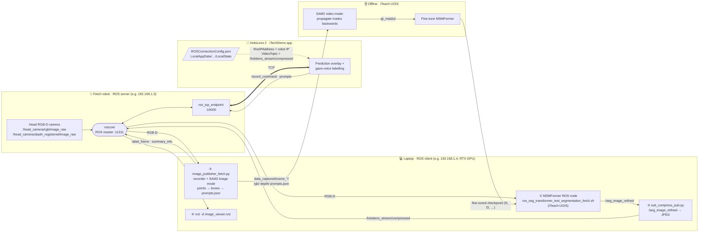

# iTeachSkillsApp

The iTeachSkills App for HoloLens2 developed by Unity. This is the gaze + voice labelling app used in the
current version of [iTeach](https://irvlutd.github.io/iTeach/). It is one of three repositories:

| Repo | Role in the pipeline |
|---|---|
| [IRVLUTD/iTeach](https://github.com/IRVLUTD/iTeach) | Project hub (overview, links, HoloLens/robot networking utilities) |
| **IRVLUTD/iTeachSkillsApp** (this repo) | HoloLens 2 app + ROS bridge: record a HumanPlay clip, place point prompts on the last frame with eye-gaze + voice, SAM2 preview |
| [IRVLUTD/iTeach-UOIS](https://github.com/IRVLUTD/iTeach-UOIS) | SAM2 mask propagation, MSMFormer fine-tuning and evaluation |

## Contents

- [iTeachSkillsApp](#iteachskillsapp)
  - [Contents](#contents)
  - [System Overview](#system-overview)
  - [Running the Live System on the Robot](#running-the-live-system-on-the-robot)
  - [Build and Deploy the HoloLens 2 App](#build-and-deploy-the-hololens-2-app)
  - [Point the App at Your ROS Server (ROSConnectionConfig.json)](#point-the-app-at-your-ros-server-rosconnectionconfigjson)
  - [Environment Setup](#environment-setup)
      - [1. Create Conda Environment](#1-create-conda-environment)
      - [2. Install ROS1 Noetic as instructed in RoboStack](#2-install-ros1-noetic-as-instructed-in-robostack)
      - [3. Compile `ros_tcp_endpoint` Package in ROS1 Noetic](#3-compile-ros_tcp_endpoint-package-in-ros1-noetic)
  - [How to Test on Linux](#how-to-test-on-linux)
      - [Terminal 1: Start ROS1 Noetic](#terminal-1-start-ros1-noetic)
      - [Terminal 2: Launch ros\_tcp\_endpoint](#terminal-2-launch-ros_tcp_endpoint)
      - [Terminal 3: Publish Images from a Video or a Scene Directory](#terminal-3-publish-images-from-a-video-or-a-scene-directory)
      - [Terminal 4: Run RVIZ to Visualize the Images](#terminal-4-run-rviz-to-visualize-the-images)
  - [Output Format and Hand-off to iTeach-UOIS](#output-format-and-hand-off-to-iteach-uois)
  - [How to Test on Windows](#how-to-test-on-windows)
      - [Terminal 1: Start ROS1 Noetic](#terminal-1-start-ros1-noetic-1)
      - [Terminal 2: Launch ros\_tcp\_endpoint](#terminal-2-launch-ros_tcp_endpoint-1)
      - [Terminal 3: Publish test images](#terminal-3-publish-test-images)

## System Overview



**Who runs what.**
- The robot is the ROS server. It runs `roscore` and `ros_tcp_endpoint`, and the HoloLens connects to its endpoint.
- The laptop is a ROS client (`ROS_MASTER_URI=http://<robot-ip>:11311`). It runs the GPU-heavy nodes: the MSMFormer node, the prediction compressor and the recorder with SAM2.

**One iTeach round.**
1. The HoloLens streams `/hololens_stream/compressed`, which is MSMFormer's live segmentation of the robot's view.
2. When the model fails, the user says **"Begin Capture"**, rearranges the objects (HumanPlay), then says **"Stop Capture"**. `image_publisher_fetch.py` saves the RGB-D clip and sends the last frame back as `label_frame`.
3. The user looks at each object and says **"True Label"** (positive point) or **"False Label"** (negative point), **"Next Object"** for the next one and **"Erase Label"** to undo. **"Send Label"** publishes the prompts. The laptop runs SAM2 on the points, sends back the box and mask preview, and saves `prompts.json` with `bboxes_xyxy`.
4. Offline, [iTeach-UOIS](https://github.com/IRVLUTD/iTeach-UOIS) propagates masks through the clip and fine-tunes MSMFormer. The new checkpoint is loaded into ①.

ROS topics:

| Topic | From → To | Type |
|---|---|---|
| `/head_camera/rgb/image_raw`, `/head_camera/depth_registered/image_raw` | robot → MSMFormer node, recorder | `sensor_msgs/Image` |
| `/seg_image_refined` (also `/seg_image`, `/seg_label`, …) | MSMFormer node → `sub_compress_pub.py`, RViz | `sensor_msgs/Image` |
| `/hololens_stream/compressed` | `sub_compress_pub.py` → HoloLens (`VideoTopic`) | `sensor_msgs/CompressedImage` |
| `/head_camera/label_frame/image_raw/compressed` | recorder → HoloLens | `sensor_msgs/CompressedImage` |
| `/hololens/out/summary_info` | recorder → HoloLens | `std_msgs/String` |
| `/hololens/out/record_command` | HoloLens → recorder | `std_msgs/Bool` |
| `/hololens/out/prompts` | HoloLens → recorder | `std_msgs/String` (JSON) |

Voice commands: *Stream, Begin Capture, Stop Capture, True Label, False Label, Next Object, Send Label, Stop Label, Erase Label, Summary*.

## Running the Live System on the Robot

Five terminals: four on the laptop, one on the robot. Every laptop terminal needs the ROS client environment first:

```bash
export ROS_MASTER_URI=http://192.168.1.3:11311   # robot IP
export ROS_HOSTNAME=192.168.1.4                  # this laptop's IP on the robot network
```

| # | Where | Env | Directory | Command |
|---|---|---|---|---|
| 0 | **robot** | robot ROS | `~/catkin_ws` | start `roscore` + the endpoint: `roslaunch ros_tcp_endpoint endpoint.launch tcp_ip:=192.168.1.3 tcp_port:=10000` (wrapped as `setup_iTeach` on our Fetch) |
| 1 | laptop | `msm38`/`msm39` | `iTeach-UOIS/uois-models/UnseenObjectsWithMeanShift` | `./experiments/scripts/ros_seg_transformer_test_segmentation_fetch.sh 0 <task_name> [--save]` |
| 2 | laptop | `iteachskills` | `iTeachSkillsApp/Python` | `python sub_compress_pub.py` |
| 3 | laptop | `iteachskills` | `iTeachSkillsApp` | `python Python/image_publisher_fetch.py` |
| 4 | laptop | `iteachskills` | `iTeachSkillsApp/Python` | `rviz -d image_viewer.rviz` |

Then start the iTechDemo app on the HoloLens, after uploading the config (next section). Captured scenes go to `Python/data_captured/scene_<MMDD>T<HHMMSS>/` as `rgb/`, `depth/` (uint16, mm), `prompts.json` and `usr_annotation_viz/`. That folder is the input to iTeach-UOIS.

To load a model fine-tuned in a previous round in terminal 1, switch the active block in `ros_seg_transformer_test_segmentation_fetch.sh` from `f0` (pretrained) to `f1`/`f2` (`new_ckpts/f*/model_final.pth`).

`image_publisher.py` (video file) and `image_publisher_label_only.py` (recorded scene folder) are **offline** stand-ins for terminal 3. Use them to test the app without the robot ([How to Test on Linux](#how-to-test-on-linux)).

## Build and Deploy the HoloLens 2 App

Requirements (Windows only; building has not been tested on other platforms):

- **Unity 2022.3.60f1**. Install this exact editor version through Unity Hub, with the *Universal Windows Platform Build Support* module. Other 2022.3 patch releases may re-import packages differently.
- **Visual Studio 2022** with the *Universal Windows Platform development* and *Game development with C++* workloads.
- A HoloLens 2 in Developer Mode with the Windows Device Portal enabled.

There are two Unity projects under `Unity/`:

| Project | Product name | Unity | Status |
|---|---|---|---|
| `Unity/iTechDemo` | iTechDemo | 2022.3.60f1 | **Current app, build this one.** It has the gaze + voice commands, SAM2 preview and `summary_info` topic (release 1.0.8). |
| `Unity/iTeachSkills` | iTeachSkillsAppTest | 2022.3.59f1 | Earlier test project, kept for reference |

MRTK 2.8.3 and the Mixed Reality OpenXR plugin are vendored as `.tgz` files in `Unity/iTechDemo/Packages/MixedReality/`. [ROS-TCP-Connector](https://github.com/Unity-Technologies/ROS-TCP-Connector) is fetched by Unity from GitHub when the project is opened, so the first open needs internet access.

> ⚠️ `Unity/iTechDemo/Packages/manifest.json` pulls ROS-TCP-Connector from its default branch without a version pin. If a newer upstream release breaks the build, pin it by appending `#v0.7.1` to that URL (the version pinned in `Unity/iTeachSkills`).

Steps:

1. Open `Unity/iTechDemo` in Unity Hub.
2. *File → Build Settings*: select **Universal Windows Platform**, set Architecture **ARM64**, and click **Switch Platform**.
3. Click **Build** into an empty folder. The ROS IP is set at runtime from `ROSConnectionConfig.json` ([below](#point-the-app-at-your-ros-server-rosconnectionconfigjson)), so no rebuild is needed when it changes.
4. Open the generated `.sln` in Visual Studio 2022 and set *Release / ARM64*. Then use *Project → Publish → Create App Packages → Sideloading* to produce an `.msix`/`.appx`.
5. Install the package through the Windows Device Portal (*Views → Apps → Deploy apps*).

A video walkthrough of the same Unity → Visual Studio → Device Portal flow (for the earlier iTeach app) is [here](https://www.youtube.com/watch?v=kvzMAMyluJU).

## Point the App at Your ROS Server (ROSConnectionConfig.json)

The app reads `ROSConnectionConfig.json` from `Application.persistentDataPath` first. On HoloLens that is the app's **`LocalAppData/<package>/LocalState/`** folder. If no file is there, it falls back to the copy built into the app at `Unity/iTechDemo/Assets/StreamingAssets/ROSConnectionConfig.json`, whose `RosIPAddress` is a lab IP. **You therefore don't need to rebuild the app to change the ROS IP.** Upload your own config to LocalState instead:

```json
{
  "RosIPAddress": "192.168.1.3",
  "RosPort": 10000,
  "KeepaliveTime": 1,
  "NetworkTimeoutSeconds": 3,
  "SleepTimeSeconds": 0.01,
  "ShowHud": false,
  "VideoTopic": "/hololens_stream/compressed",
  "LabelFrameTopic": "/head_camera/label_frame/image_raw/compressed",
  "RecordCommandTopic": "/hololens/out/record_command",
  "SendPromptsTopic": "/hololens/out/prompts",
  "SummaryInfoTopic": "/hololens/out/summary_info",
  "ImageHeight": 480,
  "ImageWidth": 640
}
```

This is the config used with the Fetch. Set `RosIPAddress` to the IP of the machine running `ros_tcp_endpoint` (the robot, in the live setup) as seen from the HoloLens. `VideoTopic` selects what the HoloLens shows: `/hololens_stream/compressed` for MSMFormer predictions, or `/head_camera/rgb/image_raw/compressed` for the raw robot view (used by the offline `image_publisher*.py` scripts). The file must contain **all** of these keys, because missing topics are read as empty. Then upload it, either:

- **Windows Device Portal:** *System → File explorer → LocalAppData → iTechDemo_… → LocalState* → upload, or
- **Script** (from [IRVLUTD/iTeach](https://github.com/IRVLUTD/iTeach) `src/`, with `HOLO_DEVICE_IP`, `HOLO_DEVICE_USERNAME`, `HOLO_DEVICE_PASSWORD` set):
  ```bash
  python hololens_utils/HoloDevicePortal.py --app_name iTechDemo --file_path ROSConnectionConfig.json
  ```

Restart the app after uploading.

## Environment Setup

#### 1. Create Conda Environment

- Create conda environment

```bash
mamba create -n iteachskills python=3.11
```

- Activate conda environment

```bash
mamba activate iteachskills
```

- Install PyTorch v2.5.1 with CUDA 11.8

```bash
python -m pip install torch==2.5.1 torchvision==0.20.1 --index-url https://download.pytorch.org/whl/cu118 --no-cache-dir
```

- Install ultralytics and the other Python dependencies used in `Python/`

```bash
python -m pip install ultralytics supervision tqdm opencv-python pillow requests --no-cache-dir
```

The SAM2 weights (`sam2.1_l.pt`) are downloaded automatically by ultralytics on first use.

#### 2. Install ROS1 Noetic as instructed in [RoboStack](https://robostack.github.io/)

- Setup channels

```bash
conda config --env --add channels conda-forge
conda config --env --add channels robostack-staging
conda config --env --remove channels defaults
```

- Install ROS1 Noetic (this also provides `rospy`, `cv_bridge`, `tf` and `message_filters`)

```bash
mamba install ros-noetic-desktop ros-noetic-ros-numpy
```

- Reactivate conda environment

```bash
mamba deactivate
mamba activate iteachskills
```

- Install tools for local development

```bash
mamba install compilers cmake pkg-config make ninja colcon-common-extensions catkin_tools rosdep
```

- Additional dependencies for developing on windows (optional)

```bash
# Install the Visual Studio command prompt - if you use Visual Studio 2019:
mamba install vs2019_win-64

# Install the Visual Studio command prompt - if you use Visual Studio 2022:
mamba install vs2022_win-64
```

#### 3. Compile `ros_tcp_endpoint` Package in ROS1 Noetic

- Clone the `ros_tcp_endpoint` package

```bash
cd ~/catkin_ws/src
git clone 'https://github.com/Unity-Technologies/ROS-TCP-Endpoint.git'
```

- Build the `ros_tcp_endpoint` package

```bash
cd ~/catkin_ws
catkin_make
```

## How to Test on Linux

#### Terminal 1: Start ROS1 Noetic

```bash
mamba activate iteachskills
roscore
```

#### Terminal 2: Launch ros_tcp_endpoint

```bash
mamba activate iteachskills
# Source Catkin Workspace
source ~/catkin_ws/devel/setup.bash
# Launch ros_tcp_endpoint (tcp_ip must be reachable from the HoloLens)
roslaunch ros_tcp_endpoint endpoint.launch tcp_ip:=<this-machine-ip> tcp_port:=10000
```

#### Terminal 3: Publish Images from a Video or a Scene Directory

1. Publish test images from the bundled `demo.mp4` video (app/UI smoke test)

```bash
mamba activate iteachskills
python Python/image_publisher.py
```

Recorded frames and the prompts are written to `Python/recordings/`.

2. Publish images from a recorded HumanPlay scene directory (the labelling mode used for the dataset)

```bash
mamba activate iteachskills
python Python/image_publisher_label_only.py --scene_folder <path_to_scene_dir>
```

`<path_to_scene_dir>` must contain an `rgb/` folder of PNG frames (see the
[layout](#output-format-and-hand-off-to-iteach-uois) below). When the user stops
recording in the app, the **last** frame is sent to the HoloLens for labelling. The prompts
and the SAM2 boxes are saved to `Python/output/prompts/<scene_name>/prompts.json`.

#### Terminal 4: Run RVIZ to Visualize the Images

```bash
mamba activate iteachskills
rviz -d Python/image_viewer.rviz
```

## Output Format and Hand-off to iTeach-UOIS

`prompts.json` written by `image_publisher_label_only.py`:

```json
{
  "prompts": [
    {"points": [{"x": 0.41, "y": 0.62}], "labels": [1]}
  ],
  "bboxes_xyxy": [[265, 208, 317, 234]]
}
```

- `prompts`: one entry per object, as sent by the HoloLens. `x`, `y` are normalized to [0, 1], and `y` is measured from the **bottom** of the image. `labels` are SAM point labels (1 = foreground, 0 = background).
- `bboxes_xyxy`: pixel boxes `[x1, y1, x2, y2]` from running SAM2 on those points on the last frame. This is the key that the mask-propagation step in iTeach-UOIS reads.

To convert the points to SAM2 pixel coordinates yourself (e.g. a 640×480 frame):

```python
import json
W, H = 640, 480
with open("prompts.json") as f:
    prompts = json.load(f)["prompts"]
sam2_point_prompts = []
for prompt in prompts:
    sam2_points = [
        (int(pt["x"] * W), int((1 - pt["y"]) * H), label)
        for pt, label in zip(prompt["points"], prompt["labels"])
    ]
    sam2_point_prompts.append(sam2_points)
```

If `prompts.json` was recorded without `bboxes_xyxy` (older captures), add them offline:

```bash
python Python/sam2_test.py --scene_folder <path_to_scene_dir>   # writes bboxes_xyxy back into the prompt file
```

**Scene layout expected by the next step** (propagation + training in [iTeach-UOIS](https://github.com/IRVLUTD/iTeach-UOIS)):

```
scene_XXX/
├── rgb/000000.png, 000001.png, ...   # 640x480 RGB, zero-padded sequential names (time order)
├── depth/000000.png, ...             # 16-bit depth in millimetres, same names as rgb/
└── prompts.json                      # copy from Python/output/prompts/<scene_name>/prompts.json
```

Then follow *Generating ground-truth masks* in the iTeach-UOIS README.

## How to Test on Windows

#### Terminal 1: Start ROS1 Noetic

```bash
mamba activate iteachskills
roscore
```

#### Terminal 2: Launch ros_tcp_endpoint

```bash
mamba activate iteachskills
# Source Catkin Workspace (adjust to where you built ros_tcp_endpoint)
call %USERPROFILE%/catkin_ws/devel/setup.bat
# Launch ros_tcp_endpoint
roslaunch ros_tcp_endpoint endpoint.launch
```

#### Terminal 3: Publish test images

```bash
mamba activate iteachskills
python Python/image_publisher.py
```

## 📚 BibTex
Please cite ***iTeach*** if it helps your research 🙌:
```bibtex
@misc{padalunkal2024iteach,
  title         = {iTeach: In the Wild Interactive Teaching for Failure-Driven Adaptation of Robot Perception},
  author        = {Jishnu Jaykumar P and Cole Salvato and Vinaya Bomnale and Jikai Wang and Yu Xiang},
  year          = {2026},
  eprint        = {2410.09072},
  archivePrefix = {arXiv},
  primaryClass  = {cs.RO},
  url           = {https://arxiv.org/abs/2410.09072}
}
```

## 📬 Contact
For any clarification, comments, or suggestions, you can choose from the following options:

- Join the [discussion forum](https://github.com/IRVLUTD/iTeach/discussions). 💬
- Report an [issue](https://github.com/IRVLUTD/iTeach/issues). 🛠️
- Contact [Jishnu](https://jishnujayakumar.github.io/). 📧

## 🙏 Acknowledgements
This work was supported by the DARPA Perceptually-enabled Task Guidance (PTG) Program under contract number HR00112220005, the Sony Research Award Program, and the National Science Foundation (NSF) under Grant No.2346528. We thank [Sai Haneesh Allu](https://saihaneeshallu.github.io/) for assistance with the real-world experiments. 🙌
