<div align="center">

# 🥽 iTeachSkillsApp

### Hands-free, gaze + voice labelling on HoloLens 2 for [iTeach](https://irvlutd.github.io/iTeach/)

<br>

[](https://irvlutd.github.io/iTeach/)
[](https://arxiv.org/abs/2410.09072)
[](LICENSE)


<br>

[**System Overview**](#-system-overview) &nbsp;·&nbsp;
[**Run on the Robot**](#-running-the-live-system-on-the-robot) &nbsp;·&nbsp;
[**Build the App**](#️-build-and-deploy-the-hololens-2-app) &nbsp;·&nbsp;
[**Configure ROS**](#-point-the-app-at-your-ros-server) &nbsp;·&nbsp;
[**Environment**](#-environment-setup) &nbsp;·&nbsp;
[**Test Offline**](#-test-without-the-robot) &nbsp;·&nbsp;
[**Output Format**](#-output-format-and-hand-off-to-iteach-uois)

</div>

<br>

The HoloLens 2 app and ROS bridge used in the current version of **iTeach**. While the robot works, you see its perception model's predictions in mixed reality. When the model fails, you record a short **HumanPlay** clip, then label the last frame **hands-free** with your eyes and voice. SAM2 turns those points into boxes and masks, which become training data for the next round.

<br>

## 🧩 Part of the iTeach Family

iTeach is split into three repositories, one per module:

<table>
  <tr>
    <th width="33%"><a href="https://github.com/IRVLUTD/iTeach">📍 iTeach</a></th>
    <th width="33%">🥽 iTeachSkillsApp <sub>(this repo)</sub></th>
    <th width="33%"><a href="https://github.com/IRVLUTD/iTeach-UOIS">🧠 iTeach-UOIS</a></th>
  </tr>
  <tr>
    <td>Project hub: overview, links, HoloLens and robot networking utilities</td>
    <td>HoloLens 2 app + ROS bridge: record HumanPlay, gaze + voice point prompts, SAM2 preview</td>
    <td>SAM2 mask propagation, MSMFormer fine-tuning and evaluation</td>
  </tr>
</table>

<br>

## 📑 Contents

<p align="center">
<a href="#-system-overview">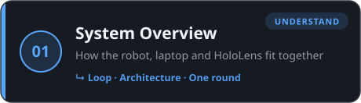</a>
<a href="#-running-the-live-system-on-the-robot">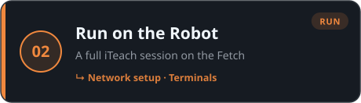</a>
<a href="#️-build-and-deploy-the-hololens-2-app">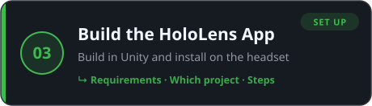</a>
<a href="#-point-the-app-at-your-ros-server">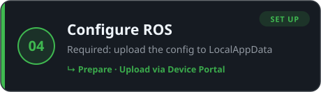</a>
<a href="#-environment-setup">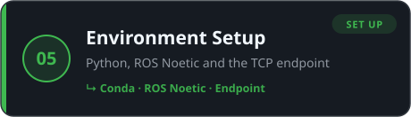</a>
<a href="#-test-without-the-robot">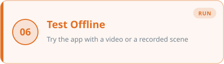</a>
<a href="#-output-format-and-hand-off-to-iteach-uois">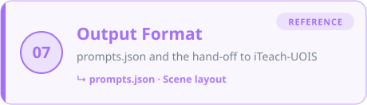</a>
<a href="#-license">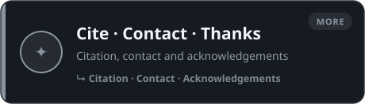</a>
</p>

<details>
<summary><b>🗂️ Full index</b> <sub>(every section and subsection as text links)</sub></summary>
<br>

<ol>
  <li><a href="#-system-overview"><b>System Overview</b></a> · How the robot, laptop and HoloLens fit together
    <ul>
    <li><a href="#-the-teaching-loop">Loop</a></li>
    <li><a href="#️-architecture">Architecture</a></li>
    <li><a href="#-one-iteach-round">One round</a></li>
    </ul>
  </li>
  <li><a href="#-running-the-live-system-on-the-robot"><b>Run on the Robot</b></a> · A full iTeach session on the Fetch</li>
  <li><a href="#️-build-and-deploy-the-hololens-2-app"><b>Build the HoloLens App</b></a> · Build in Unity and install on the headset
    <ul>
    <li><a href="#requirements">Requirements</a></li>
    <li><a href="#which-unity-project">Which project</a></li>
    <li><a href="#steps">Steps</a></li>
    </ul>
  </li>
  <li><a href="#-point-the-app-at-your-ros-server"><b>Configure ROS</b></a> · Required: upload the config to LocalAppData
    <ul>
    <li><a href="#1--prepare-rosconnectionconfigjson">Prepare</a></li>
    <li><a href="#2--upload-it-with-the-windows-device-portal">Upload via Device Portal</a></li>
    </ul>
  </li>
  <li><a href="#-environment-setup"><b>Environment Setup</b></a> · Python, ROS Noetic and the TCP endpoint
    <ul>
    <li><a href="#1--conda-environment">Conda</a></li>
    <li><a href="#2--ros-1-noetic-via-robostack">ROS Noetic</a></li>
    <li><a href="#3--build-ros_tcp_endpoint">Endpoint</a></li>
    </ul>
  </li>
  <li><a href="#-test-without-the-robot"><b>Test Offline</b></a> · Try the app with a video or a recorded scene</li>
  <li><a href="#-output-format-and-hand-off-to-iteach-uois"><b>Output Format</b></a> · prompts.json and the hand-off to iTeach-UOIS
    <ul>
    <li><a href="#promptsjson">prompts.json</a></li>
    <li><a href="#scene-layout-expected-by-iteach-uois">Scene layout</a></li>
    </ul>
  </li>
  <li><a href="#-license">License</a> · <a href="#-citation">Citation</a> · <a href="#-contact">Contact</a> · <a href="#-acknowledgements">Thanks</a></li>
</ol>

</details>

<br>

---

<br>

## 🧭 System Overview

iTeach is a loop: the robot runs a perception model, a human catches its mistakes in mixed reality, and every correction becomes training data for the next model.

<br>

### 🔁 The teaching loop

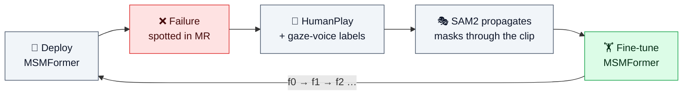

<br>

### 🏗️ Architecture

Three machines work together. Colours show where each piece runs: 🟦 robot · 🟩 laptop · 🟪 HoloLens.

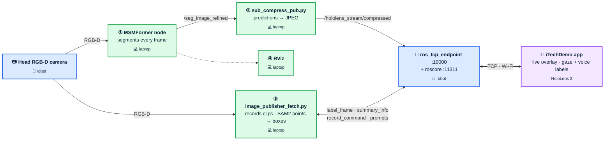

<br>

| Machine | Role | Runs |
|:--|:--|:--|
| 🤖 **Robot** | ROS **server** | `roscore` and `ros_tcp_endpoint`. The HoloLens connects here. |
| 💻 **Laptop** | ROS **client** (`ROS_MASTER_URI=http://<robot-ip>:11311`) | The GPU-heavy nodes: MSMFormer ①, prediction compressor ②, recorder + SAM2 ③, RViz ④ |
| 🥽 **HoloLens 2** | Viewer + labeller | iTechDemo app, connected to the robot's endpoint over TCP |

<br>

### 🎬 One iTeach round

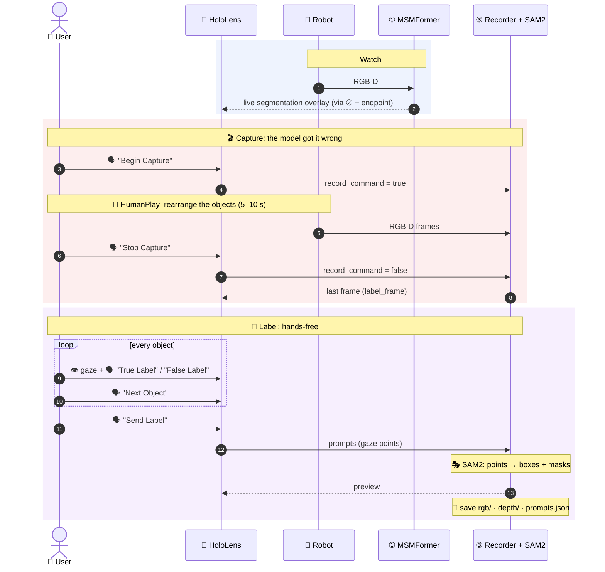

<br>

**What it looks like**

<p align="center">
  
  <br>
  <sub><i>🎬 Capture: the human rearranges objects (HumanPlay) while a short 5–10 s RGB-D clip is recorded.</i></sub>
</p>

<br>

<p align="center">
  
  <br>
  <sub><i>🎯 Label: eye-gaze places point prompts on the final frame; a voice command triggers SAM2 to turn them into bounding-box labels.</i></sub>
</p>

<br>

<sub>Afterwards, [iTeach-UOIS](https://github.com/IRVLUTD/iTeach-UOIS) propagates the masks through the clip, fine-tunes MSMFormer, and the new checkpoint is loaded back into ①.</sub>

<br>

<details>
<summary><b>📡 ROS topics</b></summary>
<br>

| Topic | From → To | Type |
|:--|:--|:--|
| `/head_camera/rgb/image_raw`<br>`/head_camera/depth_registered/image_raw` | robot → MSMFormer node, recorder | `sensor_msgs/Image` |
| `/seg_image_refined` (also `/seg_image`, `/seg_label`, …) | MSMFormer node → `sub_compress_pub.py`, RViz | `sensor_msgs/Image` |
| `/hololens_stream/compressed` | `sub_compress_pub.py` → HoloLens (`VideoTopic`) | `sensor_msgs/CompressedImage` |
| `/head_camera/label_frame/image_raw/compressed` | recorder → HoloLens | `sensor_msgs/CompressedImage` |
| `/hololens/out/summary_info` | recorder → HoloLens | `std_msgs/String` |
| `/hololens/out/record_command` | HoloLens → recorder | `std_msgs/Bool` |
| `/hololens/out/prompts` | HoloLens → recorder | `std_msgs/String` (JSON) |

</details>

<details>
<summary><b>🎙️ Voice commands</b></summary>
<br>

| Command | What it does |
|:--|:--|
| `Stream` | Open the video panel and subscribe to `VideoTopic` |
| `Begin Capture` · `Stop Capture` | Start and stop recording the HumanPlay clip |
| `True Label` · `False Label` | Add a positive / negative point where you are looking |
| `Next Object` | Start prompts for the next object |
| `Erase Label` | Remove the last object's prompts |
| `Send Label` | Publish the prompts to the laptop (SAM2 preview comes back) |
| `Stop Label` | Send the prompts one last time, clear them and close the labelling view |
| `Summary` | Toggle the status panel (`summary_info`: recording / labelling / time) |

</details>

<br>

<div align="right"><sub><a href="#-contents">⬆ back to contents</a></sub></div>

---

<br>

## 🚀 Running the Live System on the Robot

<p align="center">
  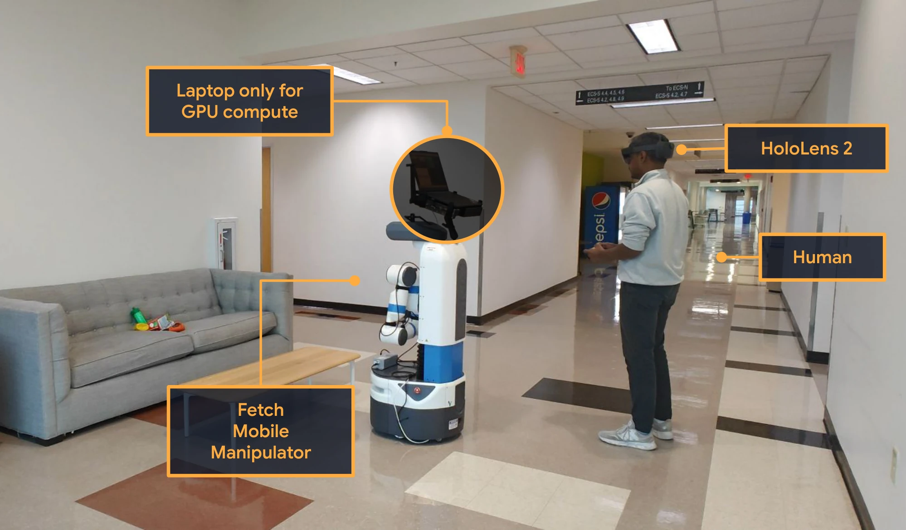
  <br>
  <sub><i>The deployed setup: Fetch with the laptop on board, and a human wearing the HoloLens 2.</i></sub>
</p>

<br>

You need five terminals: four on the laptop and one on the robot.

> [!IMPORTANT]
> Every **laptop** terminal must first point at the robot's ROS master:
> ```bash
> export ROS_MASTER_URI=http://192.168.1.3:11311   # robot IP
> export ROS_HOSTNAME=192.168.1.4                  # this laptop's IP on the robot network
> ```

<br>

| # | Where | Env | Directory | Command |
|:-:|:--|:--|:--|:--|
| **0** | 🤖 robot | robot ROS | `~/catkin_ws` | `roscore` + `roslaunch ros_tcp_endpoint endpoint.launch tcp_ip:=192.168.1.3 tcp_port:=10000`<br><sub>wrapped as `setup_iTeach` on our Fetch</sub> |
| **1** | 💻 laptop | `msm38` | `iTeach-UOIS/uois-models/UnseenObjectsWithMeanShift` | `./experiments/scripts/ros_seg_transformer_test_segmentation_fetch.sh 0 <task_name> [--save]` |
| **2** | 💻 laptop | `iteachskills` | `iTeachSkillsApp/Python` | `python sub_compress_pub.py` |
| **3** | 💻 laptop | `iteachskills` | `iTeachSkillsApp` | `python Python/image_publisher_fetch.py` |
| **4** | 💻 laptop | `iteachskills` | `iTeachSkillsApp/Python` | `rviz -d image_viewer.rviz` |

<br>

> [!CAUTION]
> **Before starting the app:** make sure `ROSConnectionConfig.json`, with `RosIPAddress` set to the robot, is in the HoloLens **`LocalAppData` → `iTechDemo_…` → `LocalState`** folder. It's uploaded through the Device Portal web tool, see [**Point the App at Your ROS Server**](#-point-the-app-at-your-ros-server). Then start **iTechDemo** on the HoloLens.

<br>

**Where the data goes.** Each capture is saved to `Python/data_captured/scene_<MMDD>T<HHMMSS>/`:

```
scene_0826T133015/
├── rgb/                  # 640×480 frames, 000000.png …
├── depth/                # uint16 depth in millimetres, same names
├── prompts.json          # gaze-voice points + SAM2 bboxes_xyxy
└── usr_annotation_viz/   # every SAM2 preview sent back to the HoloLens
```

This folder is the input to [iTeach-UOIS](https://github.com/IRVLUTD/iTeach-UOIS#-generating-ground-truth-masks-for-new-humanplay-scenes).

<br>

> [!TIP]
> **Load the model from a previous round.** In terminal 1, switch the active block in `ros_seg_transformer_test_segmentation_fetch.sh` from `f0` (pretrained) to `f1` / `f2` (`new_ckpts/f*/model_final.pth`).

> [!NOTE]
> `image_publisher.py` (video file) and `image_publisher_label_only.py` (recorded scene folder) are **offline stand-ins** for terminal 3. See [Test without the robot](#-test-without-the-robot).

<br>

<div align="right"><sub><a href="#-contents">⬆ back to contents</a></sub></div>

---

<br>

## 🛠️ Build and Deploy the HoloLens 2 App

### Requirements

> [!NOTE]
> Building is **Windows only**. It has not been tested on other platforms.

- **Unity 2022.3.60f1**: install this exact version through Unity Hub, with the *Universal Windows Platform Build Support* module. Other 2022.3 patch releases may re-import packages differently.
- **Visual Studio 2022** with the *Universal Windows Platform development* and *Game development with C++* workloads.
- **HoloLens 2** in Developer Mode, with the Windows Device Portal enabled.

<br>

### Which Unity project?

| Project | Product name | Unity | Status |
|:--|:--|:--|:--|
| `Unity/iTechDemo` | iTechDemo | 2022.3.60f1 | ✅ **Current app, build this one.** Gaze + voice commands, SAM2 preview, `summary_info` (release 1.0.8) |
| `Unity/iTeachSkills` | iTeachSkillsAppTest | 2022.3.59f1 | 🗄️ Earlier test project, kept for reference |

MRTK 2.8.3 and the Mixed Reality OpenXR plugin are included as `.tgz` files in `Unity/iTechDemo/Packages/MixedReality/`. [ROS-TCP-Connector](https://github.com/Unity-Technologies/ROS-TCP-Connector) is downloaded from GitHub when the project is first opened, so you need internet access for that.

> [!WARNING]
> `Unity/iTechDemo/Packages/manifest.json` pulls ROS-TCP-Connector from its default branch **without a version pin**. If a newer upstream release breaks the build, pin it by appending `#v0.7.1` to that URL (the version pinned in `Unity/iTeachSkills`).

<br>

### Steps

1. Open **`Unity/iTechDemo`** in Unity Hub.

2. Go to *File → Build Settings*: select **Universal Windows Platform**, set Architecture to **ARM64**, and click **Switch Platform**.

3. Click **Build** and choose an empty folder.
   <sub>The ROS IP is read at runtime from `ROSConnectionConfig.json` ([next section](#-point-the-app-at-your-ros-server)), so you don't need to rebuild when it changes.</sub>

4. Open the generated `.sln` in Visual Studio 2022 and set *Release / ARM64*. Then run *Project → Publish → Create App Packages → Sideloading* to produce an `.msix` / `.appx`.

5. Install the package through the Windows Device Portal (*Views → Apps → Deploy apps*).

6. **Upload `ROSConnectionConfig.json` to `LocalAppData` → `iTechDemo_…` → `LocalState`** in the same Device Portal. ⚠️ Required. [How →](#-point-the-app-at-your-ros-server)

<br>

📺 A video walkthrough of the same Unity → Visual Studio → Device Portal flow (for the earlier iTeach app) is [here](https://www.youtube.com/watch?v=kvzMAMyluJU).

<br>

<div align="right"><sub><a href="#-contents">⬆ back to contents</a></sub></div>

---

<br>

## 🔌 Point the App at Your ROS Server

> [!CAUTION]
> **Required before the first session:** upload **`ROSConnectionConfig.json`** to the app's **`LocalAppData` → `iTechDemo_…` → `LocalState`** folder on the HoloLens, using the **Windows Device Portal** (the HoloLens web tool). Without it, the app falls back to a built-in lab IP and **will not connect to your robot**.

<br>

### 1 · Prepare `ROSConnectionConfig.json`

This is the config used with the Fetch:

```json
{
  "RosIPAddress": "192.168.1.3",
  "RosPort": 10000,
  "KeepaliveTime": 1,
  "NetworkTimeoutSeconds": 3,
  "SleepTimeSeconds": 0.01,
  "ShowHud": false,
  "VideoTopic": "/hololens_stream/compressed",
  "LabelFrameTopic": "/head_camera/label_frame/image_raw/compressed",
  "RecordCommandTopic": "/hololens/out/record_command",
  "SendPromptsTopic": "/hololens/out/prompts",
  "SummaryInfoTopic": "/hololens/out/summary_info",
  "ImageHeight": 480,
  "ImageWidth": 640
}
```

| Key | Set it to |
|:--|:--|
| `RosIPAddress` | IP of the machine running `ros_tcp_endpoint` (**the robot** in the live setup), as seen from the HoloLens |
| `RosPort` | The endpoint's `tcp_port` (`10000`) |
| `VideoTopic` | `/hololens_stream/compressed` for MSMFormer predictions, or `/head_camera/rgb/image_raw/compressed` for the raw view (offline `image_publisher*.py` scripts) |
| `ShowHud` | `true` shows the ROS-TCP-Connector status overlay, which is handy for checking the connection |

> [!IMPORTANT]
> - The file name must be exactly **`ROSConnectionConfig.json`**.
> - Keep **all** keys. Missing topics are read as empty.
> - Save it as plain UTF-8 **without a BOM**. The app reads the raw bytes, so a BOM breaks parsing.

<br>

### 2 · Upload it with the Windows Device Portal

1. **Find the HoloLens IP.** On the headset: *Settings → Network & Internet → Wi-Fi → Advanced options*.
2. **Open the Device Portal.** In a browser on a PC on the same network, go to **`https://<HoloLens-IP>`** and accept the self-signed certificate warning.
3. **Log in** with the Device Portal username and password you set when enabling Developer Mode.
4. **Open the file explorer.** In the left menu: *System → File explorer*.
5. **Go to the app's folder:** **`LocalAppData`** → **`iTechDemo_<publisher-id>`** → **`LocalState`**.
6. **Upload.** At the bottom of the page, choose `ROSConnectionConfig.json` and click **Upload**. The file should now be listed in `LocalState`.
7. **Restart the app.** Close and reopen iTechDemo on the headset, or use *Views → Apps* in the portal.

<details>
<summary>⌨️ <b>Alternative: upload from the command line</b></summary>
<br>

From [IRVLUTD/iTeach](https://github.com/IRVLUTD/iTeach) `src/`, with the Device Portal login in the environment:

```bash
export HOLO_DEVICE_IP=<HoloLens-IP>
export HOLO_DEVICE_USERNAME=<device-portal-username>
export HOLO_DEVICE_PASSWORD=<device-portal-password>

python hololens_utils/HoloDevicePortal.py --app_name iTechDemo --file_path ROSConnectionConfig.json
```

This uploads to the same `LocalAppData/iTechDemo_…/LocalState` folder.

</details>

<br>

### Why LocalAppData?

The app looks for the config in two places, in this order:

| Order | Location | Notes |
|:-:|:--|:--|
| 1️⃣ | **`LocalAppData/iTechDemo_…/LocalState/`** on the HoloLens | Unity's `Application.persistentDataPath`. **Your config goes here.** |
| 2️⃣ | `Unity/iTechDemo/Assets/StreamingAssets/ROSConnectionConfig.json` | Built into the app. Its `RosIPAddress` is a lab IP. |

> [!TIP]
> Because the LocalState copy wins, **you never need to rebuild the app to change the ROS IP or topics**. Upload a new file and restart the app.

<br>

<div align="right"><sub><a href="#-contents">⬆ back to contents</a></sub></div>

---

<br>

## 📦 Environment Setup

### 1 · Conda environment

```bash
mamba create -n iteachskills python=3.11
mamba activate iteachskills

# PyTorch 2.5.1 + CUDA 11.8
python -m pip install torch==2.5.1 torchvision==0.20.1 --index-url https://download.pytorch.org/whl/cu118 --no-cache-dir

# Python dependencies used in Python/
python -m pip install ultralytics supervision tqdm opencv-python pillow requests --no-cache-dir
```

<sub>The SAM2 weights are downloaded automatically by ultralytics the first time they are used.</sub>

<br>

### 2 · ROS 1 Noetic via [RoboStack](https://robostack.github.io/)

```bash
# Channels
conda config --env --add channels conda-forge
conda config --env --add channels robostack-staging
conda config --env --remove channels defaults

# ROS Noetic (includes rospy, cv_bridge, tf, message_filters) + ros_numpy
mamba install ros-noetic-desktop ros-noetic-ros-numpy

# Reactivate
mamba deactivate && mamba activate iteachskills

# Build tools
mamba install compilers cmake pkg-config make ninja colcon-common-extensions catkin_tools rosdep
```

<details>
<summary>🪟 Extra dependencies for developing on Windows (optional)</summary>
<br>

```bash
# Visual Studio 2019 command prompt
mamba install vs2019_win-64

# Visual Studio 2022 command prompt
mamba install vs2022_win-64
```

</details>

<br>

### 3 · Build `ros_tcp_endpoint`

```bash
cd ~/catkin_ws/src
git clone https://github.com/Unity-Technologies/ROS-TCP-Endpoint.git

cd ~/catkin_ws
catkin_make
```

<br>

<div align="right"><sub><a href="#-contents">⬆ back to contents</a></sub></div>

---

<br>

## 🧪 Test Without the Robot

These steps run the whole app loop on a single machine, fed by a video or a recorded scene instead of the Fetch.

<br>

### 🐧 Linux

**Terminal 1: ROS master**

```bash
mamba activate iteachskills
roscore
```

**Terminal 2: TCP endpoint** (the `tcp_ip` must be reachable from the HoloLens)

```bash
mamba activate iteachskills
source ~/catkin_ws/devel/setup.bash
roslaunch ros_tcp_endpoint endpoint.launch tcp_ip:=<this-machine-ip> tcp_port:=10000
```

**Terminal 3: publish images.** Pick one:

| Mode | Command | Output |
|:--|:--|:--|
| 🎞️ **Demo video** (app / UI smoke test) | `python Python/image_publisher.py` | `Python/recordings/` |
| 🗂️ **Recorded scene** (the labelling mode used for the dataset) | `python Python/image_publisher_label_only.py --scene_folder <scene_dir>` | `Python/output/prompts/<scene_name>/prompts.json` |

<sub>`<scene_dir>` must contain an `rgb/` folder of PNG frames. When you stop recording in the app, the **last** frame is sent to the HoloLens for labelling.</sub>

**Terminal 4: RViz**

```bash
mamba activate iteachskills
rviz -d Python/image_viewer.rviz
```

> [!NOTE]
> For these offline scripts, set `VideoTopic` to `/head_camera/rgb/image_raw/compressed` in the config.

<br>

<details>
<summary><b>🪟 Windows</b></summary>
<br>

**Terminal 1: ROS master**

```bat
mamba activate iteachskills
roscore
```

**Terminal 2: TCP endpoint** (adjust the path to where you built `ros_tcp_endpoint`)

```bat
mamba activate iteachskills
call %USERPROFILE%/catkin_ws/devel/setup.bat
roslaunch ros_tcp_endpoint endpoint.launch
```

**Terminal 3: publish test images**

```bat
mamba activate iteachskills
python Python/image_publisher.py
```

</details>

<br>

<div align="right"><sub><a href="#-contents">⬆ back to contents</a></sub></div>

---

<br>

## 📤 Output Format and Hand-off to iTeach-UOIS

### `prompts.json`

```json
{
  "prompts": [
    {"points": [{"x": 0.41, "y": 0.62}], "labels": [1]}
  ],
  "bboxes_xyxy": [[265, 208, 317, 234]]
}
```

| Key | Meaning |
|:--|:--|
| `prompts` | One entry per object, as sent by the HoloLens. `x`, `y` are normalized to [0, 1], and **`y` is measured from the bottom** of the image. `labels` are SAM point labels (1 = foreground, 0 = background). |
| `bboxes_xyxy` | Pixel boxes `[x1, y1, x2, y2]` from running SAM2 on those points on the last frame. **This is what iTeach-UOIS reads.** |

<br>

> [!TIP]
> Older captures without `bboxes_xyxy`? Add them offline:
> ```bash
> python Python/sam2_test.py --scene_folder <scene_dir>   # writes bboxes_xyxy back into the prompt file
> ```

<details>
<summary>🐍 Convert the points to SAM2 pixel coordinates yourself</summary>
<br>

```python
import json

W, H = 640, 480  # frame size

with open("prompts.json") as f:
    prompts = json.load(f)["prompts"]

sam2_point_prompts = []
for prompt in prompts:
    sam2_points = [
        (int(pt["x"] * W), int((1 - pt["y"]) * H), label)
        for pt, label in zip(prompt["points"], prompt["labels"])
    ]
    sam2_point_prompts.append(sam2_points)
```

</details>

<br>

### Scene layout expected by iTeach-UOIS

```
scene_XXX/
├── rgb/000000.png, 000001.png, …   # 640×480 RGB, zero-padded sequential names (time order)
├── depth/000000.png, …             # 16-bit depth in millimetres, same names as rgb/
└── prompts.json                    # from data_captured/ (live) or output/prompts/<scene>/ (offline)
```

➡️ Next: [**Generating ground-truth masks**](https://github.com/IRVLUTD/iTeach-UOIS#-generating-ground-truth-masks-for-new-humanplay-scenes) in iTeach-UOIS.

<br>

<div align="right"><sub><a href="#-contents">⬆ back to contents</a></sub></div>

---

<br>

## 📜 License

Released under the [**MIT License**](LICENSE), © 2024-2026 Intelligent Robotics and Vision Lab (IRVL), The University of Texas at Dallas.

<sub>Third-party packages bundled with the Unity projects (MRTK, OpenXR, ROS-TCP-Connector) keep their own licenses.</sub>

<br>

## 📚 Citation

If ***iTeach*** helps your research, please cite:

```bibtex
@misc{padalunkal2024iteach,
  title         = {iTeach: In the Wild Interactive Teaching for Failure-Driven Adaptation of Robot Perception},
  author        = {Jishnu Jaykumar P and Cole Salvato and Vinaya Bomnale and Jikai Wang and Ayush Bhardwaj and Jin-Ryong Kim and Yu Xiang},
  year          = {2026},
  eprint        = {2410.09072},
  archivePrefix = {arXiv},
  primaryClass  = {cs.RO},
  url           = {https://arxiv.org/abs/2410.09072}
}
```

<br>

## 📬 Contact

| | |
|:--|:--|
| 💬 Questions & ideas | [Discussion forum](https://github.com/IRVLUTD/iTeach/discussions) |
| 🛠️ Bugs | [Open an issue](https://github.com/IRVLUTD/iTeach/issues) |
| 📧 Direct | [Jishnu](https://jishnujayakumar.github.io/) |

<br>

## 🙏 Acknowledgements

This work was supported by the DARPA Perceptually-enabled Task Guidance (PTG) Program under contract number HR00112220005, the Sony Research Award Program, and the National Science Foundation (NSF) under Grant No. 2346528. We thank [Sai Haneesh Allu](https://saihaneeshallu.github.io/) for assistance with the real-world experiments.

<br>

<div align="center">
<sub>Built at the <a href="https://labs.utdallas.edu/irvl/">Intelligent Robotics and Vision Lab</a>, The University of Texas at Dallas</sub>
</div>
